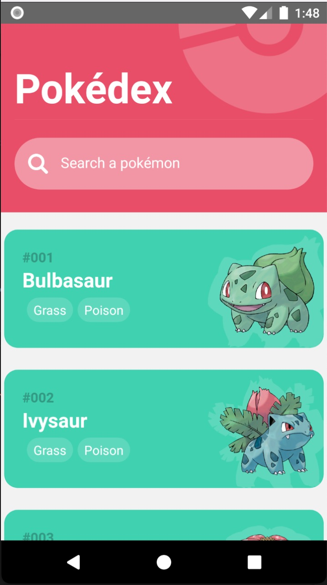
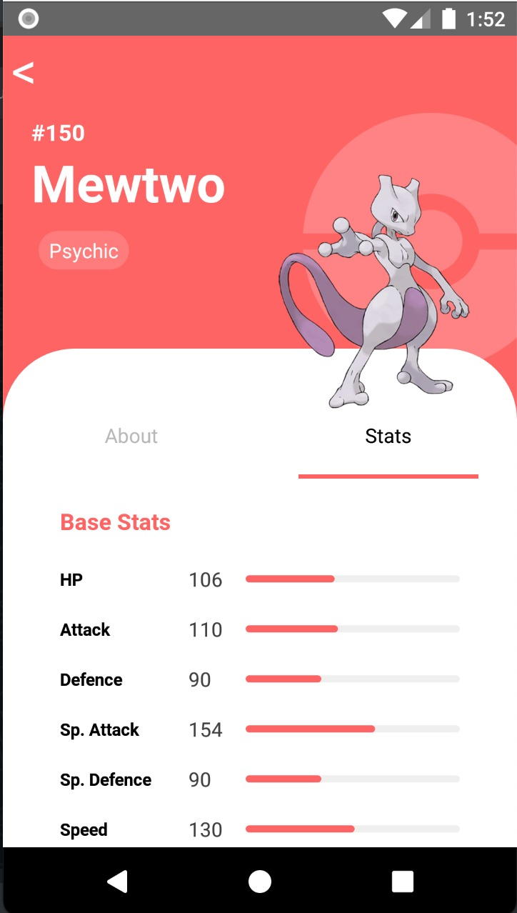

<h1 align="center">POKÉDEX</h1>

<br>

<div align="center" >
  
  
  
</div>

<br><br>

### 💻 Projeto Pokédex

Consumida em uma aplicação em React Native, as informações fornecidas pela API Pública da Poke API. Lista com os pokémons da API e, ao clicar no Pokémon e/ou utilizando o campo de pesquisa, é mostrado em tela várias infos sobre o Pokémon selecionado.

<br>

Itens:
- [x] Consumo da Pokeapi.co
- [x] Duas telas com: uma lista de pokémons e outra com algumas infos do Pokémon escolhido
- [x] Lista com Pokémons
- [x] Infos de Pokémons: principais, sobre e stats
- [x] Imagens ilustrativas de cada Pokémon
- [x] Gráficos com nivelamento de poder base

<br>

### 🧪 Tecnologias
- ✅ React Native
- ✅ React-Navigation (4x)
- ✅ Axios
- ✅ Flatlist
- ✅ StyleSheet
- ✅ Eslint

<br>

** a imagem de loading não funciona em emuladores

<br>
## 🚀 Realizando download e Instalando o Projeto

Para realizar o clone e instalação do projeto, siga as etapas abaixo:

Clone o projeto e entre no diretório criado:

```
git clone https://github.com/luisgustavofin/App-Pokedex
cd App-Pokedex
```

Instale as dependências:
```
npm install
```

Inicie a aplicação no emulador:
```
react-native run-android
```